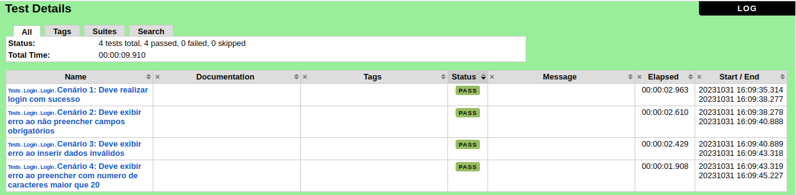

# Automação de Testes de Formulário de Registro com Robot Framework

Criação de casos de testes automatizados para um formulário de registro.


## Instalação

Para executar o projeto é necessário que algumas instalações sejam realizadas, para isso, siga os passos do documento abaixo:

[Instalação do ambiente para utilizar o robot](https://medium.com/lusitanos-qa/instala%C3%A7%C3%A3o-do-ambiente-para-utilizar-o-robot-framework-em-aplica%C3%A7%C3%B5es-web-34a141b9bf44)

## Rodando os testes

Para rodar os testes, rode o seguinte comando

```bash
  robot -d reports ./tests
```
## Relatórios

Os relatórios são automaticamente gerados na pasta reports. Basta abrir o arquivo report.html

